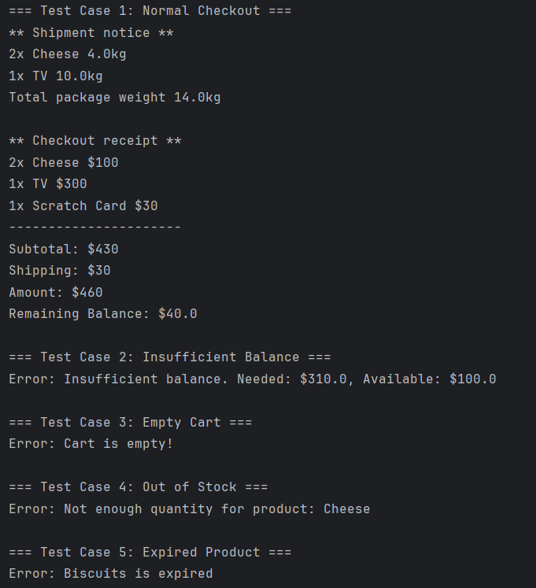

# Fawry Intern Task

## Task Description

Design an e-commerce system with the following features:

- Products can be expirable or non-expirable
- Products can be shippable (with weight) or non-shippable
- Customers can:
  - Add products to cart
  - Checkout and receive receipt
  - Get shipment notice for shippable items
- System handles:
  - Expired or out-of-stock products
  - Insufficient balance
  - Empty cart

## How to Run

1. Open the project in your Java IDE (e.g., IntelliJ, Eclipse).
2. Navigate to `fawrytask/` and locate the `Main.java` file.
3. Run `Main.java` to simulate the e-commerce functionality.

## Screenshots

